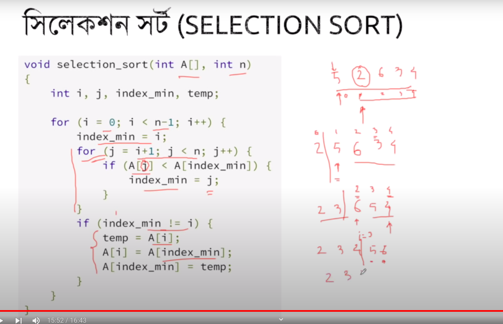

### vdo 7 sorting starts>>>
selection sort is called the most easiest sorting algorithm

jekono shongkha ke list er choto theke boro akare sajaya felanor kaaj..

[10,5,2,8,7]

frst element re shobcheye choto dhore loop chalaya compare kore ber korbe ke shobcheye choto.. then otar sathe index er value exchange korbe


``` >> [2,5,10,8,7] ```

ebar ar 0th index theke loop start hobe na... ebar 1st index theke loop start hobe ar protibar ekta ekta kore value update hobe
```
>> [2,5,10,8,7]
>> [2,5,7,8,10]
>> [2,5,7,8,10]
```

Complexity:
```
>> 1st (1>>>>n)
>> 2nd (2>>>n)
>> ...()
>>...()
>> n-1 (n-1>>n)
```
selection sort er complexity >> O(n^2)

implementation code

