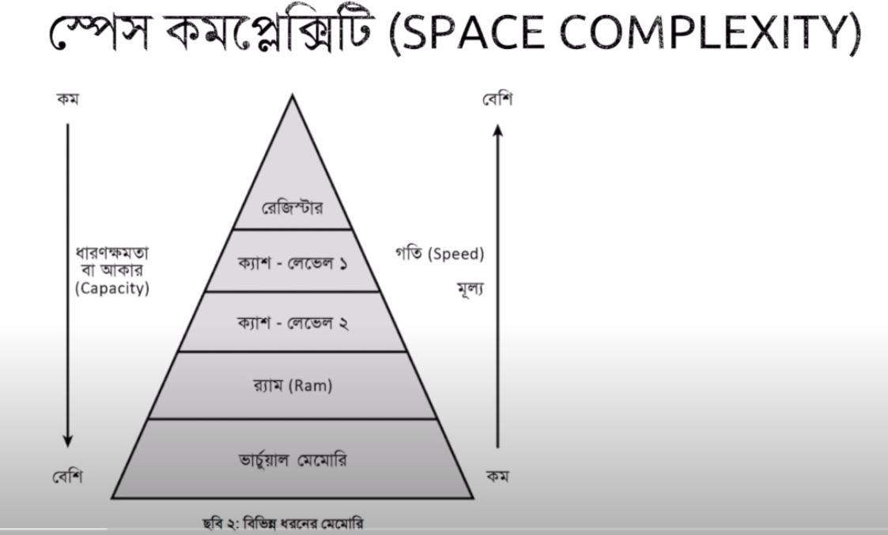
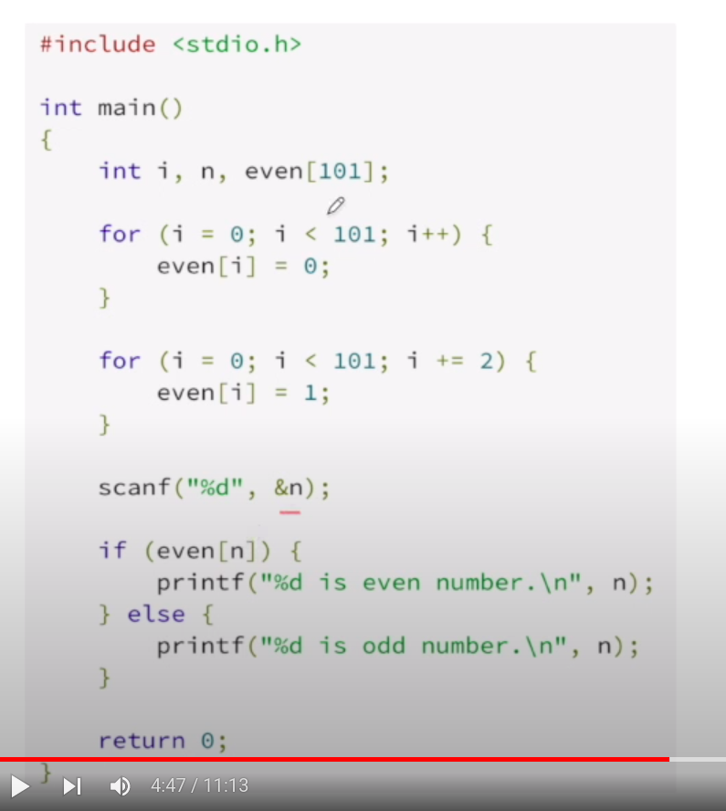

Register, cache level1, cache level2 thaake direct processor er moddhe

RAM motherboard er sathe
Virtual mermory  >>>> amra harddisk er ekta portion re virtual memory hishabe count kora jaay

[](./space_graph.png)

* Register er speed shobcheye beshi ar capacity shobcheye kom
* Vram er capacity shobcheye beshi speed shobcheye kom
* Bakigula ei sequence maintain kore
* Onek shomoy problem onujayi amader trade-off kora laage

Space complexityo Big O notation diyei hishab kora hoy..
Ekta odd even er normal ar loop diye problem dekhaise

```
n = int(input())
if n % 2 == 0:
	print(“%n is even” %(n)”)
else:
	print(“%n is odd” %(n)”)
```
Etar time complexity O(1) karon ekta modulus operaiton ar ekta comparison operation hocche
Etar space complexity jodi amra chinta kori 

tahole etar space complexity hobe O(1). ekhane amra ekta variable use kortesi..n er maan jai hok na keno n = 1,2,1k,1-crore jai hok na keno oy 4 byte space e use korbe

another example >>>

[](space_problem2.png)

Ekhane jehetu aage theke n er highest nmbr bole dewa … ejonne even array er maan declare kora … n er maaner upore even array r maan define kore dewa…taai etar space complexity Order of n.
*  2 dimensional array thakle hoile O(n^2) .. 3 dimensional array hole O(n^3)

Matrix addition er time array kaaje laage>>> etar shomoy space complexity O(n^2) jodi square matrix hoy… ultimately oi maximum array er dimension er upore shob depend kore

